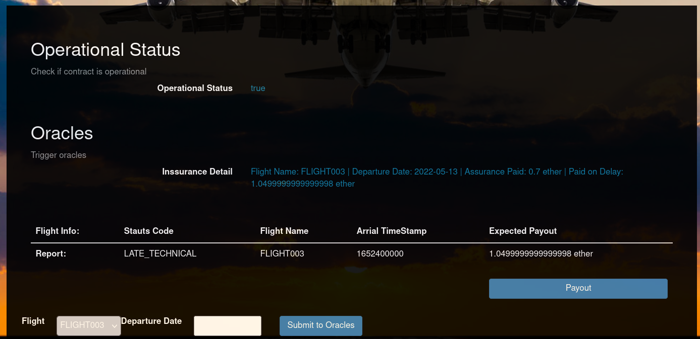

# nd13011_flightsurety
========================
Created : 2022-05-20 02:17
Tag: 

## ganache set up
```
╰─❯ ganache-cli -h 0.0.0.0 --chainId 1373  --gasLimit 300000000 --gasPrice 20000000000 --accounts=100 -m "offer write sand beyond wolf case country idle since wool deposit wise"
Ganache CLI v6.12.2 (ganache-core: 2.13.2)

Available Accounts
==================
(0) 0x071de903f003F31476d25bcAf621b5E1251e0B22 (100 ETH)
(1) 0x14125aDcd80323f58aeb841429C7FeD9B1720049 (100 ETH)
(2) 0xe232c61614097147619af532Eb3aD0dd80Df693f (100 ETH)
(3) 0xdB631828274B2397086F38dEf0068Be415970A41 (100 ETH)
(4) 0x4619C23B652312e073e745B2311d38646C1ab9DD (100 ETH)
(5) 0x1691C83aBa94E3b55A8A449201060f784cdf25f2 (100 ETH)
(6) 0xDc81f9bd7C8a0fE6099DDC36b5847239fB719E68 (100 ETH)
(7) 0xfb19699322b797cAA73EB4B0F962380eB2417558 (100 ETH)
(8) 0x127eB438D0A5e2843364D8627998067897bF787A (100 ETH)
(9) 0x85EB87480645edDeF4a45a5c74a2AFE0F404FB4E (100 ETH)
(10) 0x9Fb4012540F0B5Ad5935B036e9E2F120fD80d674 (100 ETH)
(11) 0x713Bf4c3fBc797aE5EfBa84A3C0000eFbE6D791C (100 ETH)
(12) 0xb9b6aD36235F278C0cAa4062d12CfC5a33653DA6 (100 ETH)
(13) 0xbe3387832a519c44B92ac45c544267AA4D2dE525 (100 ETH)
(14) 0xA00aAf3f19DA9214ba978C1817776a51c131f3F6 (100 ETH)
(15) 0x4643ca0CC26B3d1F7B8Be3d9C583Ea437F43cB41 (100 ETH)
(16) 0xB8Ee6ea4Dd54E75e2B12BD20893Fde098F744CEC (100 ETH)
(17) 0x17c75F67Af6a6dBe0DE1d2208620111f2A93f3eB (100 ETH)
(18) 0xD3948977Cd46879a0AF750CC637aD26E61A2791B (100 ETH)
(19) 0xd1FbF022193E69e6cd30aFF7C763922C7C1DFE45 (100 ETH)
(20) 0x934b4321abB87F74e26bF3aB27D41AEF9F614f5c (100 ETH)
(21) 0x33E22C62d86a8C8491cF74d801ea2113D0F9C107 (100 ETH)
(22) 0x53Bde5CA95C1D3B9cC08eFE114cf2cb6382727dc (100 ETH)
(23) 0x91c6F7fb5d967D1Ea817739081cFeCfbcf7Ce1F8 (100 ETH)
(24) 0x70ECe8FAE0293C102A1d6854B87438e6C2FC1d01 (100 ETH)
(25) 0x75C0f3AA6ed81750cd6beA2887b8BdF74b8cF389 (100 ETH)
(26) 0xC938D16e49d7d11cC06A98A3d6BCF24d3C8840Eb (100 ETH)
(27) 0x03519edb590cD48bD362202F479fDd7ED8De73e9 (100 ETH)
(28) 0x3a5A0ba3994850550111fACb54d5fA71b3f95C35 (100 ETH)
(29) 0x256BB0FBa6a6403a940f19933fE23fdcB02Cc4C7 (100 ETH)
(30) 0x2782890B042b65cB0C1b4587Ae2E51a04695C5Ce (100 ETH)
(31) 0xE057461949ccB3f4Ed4758eEc236Bb9cc44116e7 (100 ETH)
(32) 0x9f9f96E74288770BAdcde17cb818605485A26068 (100 ETH)
(33) 0x002aE28Fe9b8D476ADa5eD80485ed543e768237F (100 ETH)
(34) 0x5b6f7A25B690251C9ff14603c5d415414c7322cE (100 ETH)
(35) 0x1Ec370e0B6F90609636954CB72b1ED4F327154fe (100 ETH)
(36) 0xd3478a154EfA3fEEB5c0B3832371b0fBda2568b6 (100 ETH)
(37) 0x72EAa17616ac138c86Cb205baDDb7D02E2685Ce0 (100 ETH)
(38) 0xA09915C864D45BA3239fB8B6F775d023b2A07C79 (100 ETH)
(39) 0x1592fd4cA219A3455275752203a8aF1791A695BC (100 ETH)
(40) 0xd74B17BbDb26FEe4Bc39853fa81cF997ACf1Dfeb (100 ETH)
(41) 0x9e70Dec2D4D6c7D77f0680aDE73Fbd4817017b67 (100 ETH)
(42) 0x8b02CC28347C754e80854f699373976A0240Cb65 (100 ETH)
(43) 0x707795268d97Ab3418B711e2d47F7E675D00dC7E (100 ETH)

Private Keys
==================
(0) 0xd70c3f31ff5c96ecea3c4fbff8c300be7ee3eecc8735715675679b939f613416
(1) 0x1ca292effd0c715dff2f8cbbb4d235e0966a8ef2436f25b5265803642538b8ad
(2) 0x924379c5eec3c86759497583c9718370700b2ccab59ac74a986b5fdaea241079
(3) 0xd20994d28acc98e32fc1ced8c395d93cda9c27f7975017d7af693f5a1a648e00
(4) 0xee01db98de84655ac198c1cb8b07a4e8c85c99c44e37170604844a0f957b17dd
(5) 0xb5c494478486883a9f030d66edcd8844651ebab2f153aa0b4710c8f665785f3b
(6) 0xbc0c2568598232758a6da4f92469a7b99e1f9fc6a21fb0f003569ccbb73a7a8c
(7) 0x655882efca50b4b69ef735548dbca3f0c4721853dbed3426c72b6db591285a73
(8) 0xffa8109b8602a3f241d569344926d76c1a1a6ce7279f98971c61d21863d438b2
(9) 0x5313176d99324406a0ab76524d9e7afb221bd20ce5c8bd7f0efc449a8ed17b6b
(10) 0xd2b3a8958345dce2f95fcca144ab7735e5c8135c79649f5d88bec89e184411f3
(11) 0x9fbf8765ca349aa954b5e60898b47528ba3eff52a4084288657105fe455bbda8
(12) 0x38bea05ce44cc0686bc48ab597008be9fff850a8b43d491974f845027562098e
(13) 0xbf533039e36259b204005b0bf56437fd7baf8fc7cc8a4d9c6b77a8965c9fb5ff
(14) 0x931103cbae6b983047d21a2708bf82ef9886a27fef05e4eff4f0a906f1b0357e
(15) 0x3ce53a52185da94c4599cecd42ec480d2c03809b7bed521c45cd508755e10a74
(16) 0x116485f9496638870b020d6b1f8b15aa24dc6528f09bb3ca5cc3701c71b38e8f
(17) 0x1851d2f4c1b82048e0bdafdc4148a9469541518e226d849d9250e0e4b9ca98ee
(18) 0xe3450fb25066dc2b059cde4380280f17244dbdd3b1821a6d1f614b349a54850c
(19) 0x237316de2e17bf743c450c00f39399ecdbdcb3ba62cc2d2eb6966832c29fdc64
(20) 0x5645aa8706068d40b64b5373b0461477730cf08a2ce1a95d89eb2cbd2593bef5
(21) 0xcf5a4fcf45096337191636ae74ec67d430ecfca387cef75804ccb36eeb636531
(22) 0x9f92244fe9dec6bd5af2a9359db838a8892c47ec70f9edb9b0d3a8efdf4667ce
(23) 0xf6d1479715d4d8dcc8ef813f3036458dfd4296742f468f4bc80efef3540094fb
(24) 0xd9ddb6a7873f61841d6494b8a561dffd4dcd80c65c02e4517ab7cafa416cb690
(25) 0xa3ad54394781ce0e02407c60843ba84dbb736ee48f488b0749e91b0de3bef42a
(26) 0x293c8863544d134045bb965e34084b93d430bcf72497ae097b55055f24aac117
(27) 0x31045cd3e971ef36812adcf02577107364b1b54bdf1bec228d70446445f22cc4
(28) 0xbd44cd5c8d3bd8ea86c369e40e55eb93f2bf11795c10b0df817eb9a25f0f7bae
(29) 0x91ff1be19d154cc5221c337d35ec6feb6005cc1cacbdef8a9fc047a4e7c3af60
(30) 0x40d4608ccc0b7700dde72e360f768629c1f9e3c551f5f0d825c3493ee1353233
(31) 0x1a3afb0573468f6b615569cd119cba6e738ba8b7c790ca2e5a4a163c2869fb63
(32) 0x04df7515938db8c0b88c588507b7ad072b54e42caa9874b56f898c501e0460ea
(33) 0xdcd1da226c1b4d3aada052e1353eb7e5190320e235d81add41835f3a2c916837
(34) 0x88990c8463bc8f0bfdc3ba74ac98be34c16cb8b339378c4dd04fb0ae697f9c5f
(35) 0x0c6491000458b4bcbd1fd762ab674fb7b0bb5dae4470d03df35c160379435735
(36) 0xf5e9580b212c620a522fc629fb0b91ccb1291991fdac7366845c25ddd99a5e9e
(37) 0xb596947843b892eb137e99f7a56ccbbb7bb67b29180f52734c6bc76cd8a158e6
(38) 0xfeb84daf5b5f3f025497a21320defcefa62b53dd5288c2a2dc558dd75fe27961
(39) 0xc62b097392950ca7490f1767a3ca66df448ad91a19105ba04199f8d1f0dbd41c
(40) 0x546dba49c5984189a1ca7d9a9bb99ba5d8ce795340beb5013ff0697ea2cbf4b6
(41) 0x1ac911c99ebf2c011d52f54a3e12b162abb288d310dcd91027acabca96ed27b3
(42) 0x6f6e1842876344c7573bb102dbdba5e290d086019970ef94f2be4d30fa4e2559
(43) 0x4faa646ad55cfeb5451b428e6d905830259c54258667e7ffe0b26920c6f9a858
(44) 0xb3d1547138e211b03ca38e4c0d5cf41801e6492b9a3b3a65491c9aebbdc58f2e
(45) 0xf36921ba33b20a34770710baed7edb09df13c331c4fdc0b287e4c22135e8916a


HD Wallet
==================
Mnemonic:      offer write sand beyond wolf case country idle since wool deposit wise
Base HD Path:  m/44'/60'/0'/0/{account_index}

Gas Price
==================
20000000000

Gas Limit
==================
300000000

Call Gas Limit
==================
9007199254740991

Listening on 0.0.0.0:8545

```

## test results
### flightsurety tests
```
node ➜ /workspaces/typescript-node/nd1301/FlightSurety_mkj (master ✗) $ truffle test ./test/flightSurety.js

Using network 'development'.


Compiling your contracts...
===========================
> Everything is up to date, there is nothing to compile.


  Contract: Flight Surety Tests
    ✔ (multiparty) has correct initial isOperational() value
    ✔ (multiparty) can block access to setOperatingStatus() for non-Contract Owner account (216ms)
    ✔ (multiparty) can allow access to setOperatingStatus() for Contract Owner account (235ms)
    ✔ (multiparty) can block access to functions using requireIsOperational when operating status is false (230ms)
    Airlines
        Flight 0xe232c61614097147619af532Eb3aD0dd80Df693f registeration failed with : Error: VM Exception while processing transaction: revert Airline is not funded
      ✔ (airline) cannot register another Airline using registerAirline() if it is not funded (107ms)
        Flight isAirlineFunded resulted : true
      ✔ Only existing airline may register a new airline until there are at least four airlines registered (766ms)
      ✔ Registration of fifth and subsequent airlines requires multi-party consensus of 50% of registered airlines (1841ms)
        Flight OS 075 at 1616869800000 has been registered by 0x14125aDcd80323f58aeb841429C7FeD9B1720049
        Flight UPS 275 at 1616968800000 has been registered by 0xe232c61614097147619af532Eb3aD0dd80Df693f
        Flight TK 1888 at 1618048800000 has been registered by 0xdB631828274B2397086F38dEf0068Be415970A41
        Flight EW 7751 at 1618254000000 has been registered by 0x4619C23B652312e073e745B2311d38646C1ab9DD
        Flight LX 1583 at 1618430400000 has been registered by 0x1691C83aBa94E3b55A8A449201060f784cdf25f2
      ✔ Airline can register a flight (3577ms)
    Passengers
      ✔ Passengers can purchase flight insurance for up to 1 ether


  9 passing (9s)
```
### oracle tests
```
node ➜ /workspaces/typescript-node/nd1301/FlightSurety_mkj (master ✗) $ truffle test ./test/oracles.js
Using network 'development'.


Compiling your contracts...
===========================
> Everything is up to date, there is nothing to compile.


  Contract: Oracles
    Oracles
Oracle Registered: 7, 3, 9
Oracle Registered: 6, 8, 7
Oracle Registered: 0, 7, 5
Oracle Registered: 4, 0, 7
Oracle Registered: 8, 1, 6
Oracle Registered: 4, 5, 9
Oracle Registered: 9, 0, 7
Oracle Registered: 8, 9, 0
Oracle Registered: 7, 0, 6
Oracle Registered: 0, 5, 9
Oracle Registered: 6, 3, 9
Oracle Registered: 6, 7, 1
Oracle Registered: 7, 8, 0
Oracle Registered: 6, 0, 8
Oracle Registered: 7, 1, 3
Oracle Registered: 3, 5, 4
Oracle Registered: 9, 2, 3
Oracle Registered: 0, 4, 6
Oracle Registered: 4, 2, 1
Oracle Registered: 4, 9, 3
      ✔ can register oracles (18904ms)

Error => idx: 0, oracleIndexes: 6, flight: ND1309, timestamp: 1655349802

Error => idx: 2, oracleIndexes: 7, flight: ND1309, timestamp: 1655349802

Error => idx: 0, oracleIndexes: 0, flight: ND1309, timestamp: 1655349802

Error => idx: 1, oracleIndexes: 7, flight: ND1309, timestamp: 1655349802

Error => idx: 2, oracleIndexes: 5, flight: ND1309, timestamp: 1655349802

Error => idx: 0, oracleIndexes: 4, flight: ND1309, timestamp: 1655349802

Error => idx: 1, oracleIndexes: 0, flight: ND1309, timestamp: 1655349802

Error => idx: 2, oracleIndexes: 7, flight: ND1309, timestamp: 1655349802

Error => idx: 1, oracleIndexes: 1, flight: ND1309, timestamp: 1655349802

Error => idx: 2, oracleIndexes: 6, flight: ND1309, timestamp: 1655349802

Error => idx: 0, oracleIndexes: 4, flight: ND1309, timestamp: 1655349802

Error => idx: 1, oracleIndexes: 5, flight: ND1309, timestamp: 1655349802

Error => idx: 2, oracleIndexes: 9, flight: ND1309, timestamp: 1655349802

Error => idx: 0, oracleIndexes: 9, flight: ND1309, timestamp: 1655349802

Error => idx: 1, oracleIndexes: 0, flight: ND1309, timestamp: 1655349802

Error => idx: 2, oracleIndexes: 7, flight: ND1309, timestamp: 1655349802

Error => idx: 1, oracleIndexes: 9, flight: ND1309, timestamp: 1655349802

Error => idx: 2, oracleIndexes: 0, flight: ND1309, timestamp: 1655349802

Error => idx: 0, oracleIndexes: 7, flight: ND1309, timestamp: 1655349802

Error => idx: 1, oracleIndexes: 0, flight: ND1309, timestamp: 1655349802

Error => idx: 2, oracleIndexes: 6, flight: ND1309, timestamp: 1655349802

Error => idx: 0, oracleIndexes: 0, flight: ND1309, timestamp: 1655349802

Error => idx: 1, oracleIndexes: 5, flight: ND1309, timestamp: 1655349802

Error => idx: 2, oracleIndexes: 9, flight: ND1309, timestamp: 1655349802

Error => idx: 0, oracleIndexes: 6, flight: ND1309, timestamp: 1655349802

Error => idx: 1, oracleIndexes: 3, flight: ND1309, timestamp: 1655349802

Error => idx: 2, oracleIndexes: 9, flight: ND1309, timestamp: 1655349802

Error => idx: 0, oracleIndexes: 6, flight: ND1309, timestamp: 1655349802

Error => idx: 1, oracleIndexes: 7, flight: ND1309, timestamp: 1655349802

Error => idx: 2, oracleIndexes: 1, flight: ND1309, timestamp: 1655349802

Error => idx: 0, oracleIndexes: 7, flight: ND1309, timestamp: 1655349802

Error => idx: 2, oracleIndexes: 0, flight: ND1309, timestamp: 1655349802

Error => idx: 0, oracleIndexes: 6, flight: ND1309, timestamp: 1655349802

Error => idx: 1, oracleIndexes: 0, flight: ND1309, timestamp: 1655349802

Error => idx: 0, oracleIndexes: 7, flight: ND1309, timestamp: 1655349802

Error => idx: 1, oracleIndexes: 1, flight: ND1309, timestamp: 1655349802

Error => idx: 2, oracleIndexes: 3, flight: ND1309, timestamp: 1655349802

Error => idx: 0, oracleIndexes: 3, flight: ND1309, timestamp: 1655349802

Error => idx: 1, oracleIndexes: 5, flight: ND1309, timestamp: 1655349802

Error => idx: 2, oracleIndexes: 4, flight: ND1309, timestamp: 1655349802

Error => idx: 0, oracleIndexes: 9, flight: ND1309, timestamp: 1655349802

Error => idx: 1, oracleIndexes: 2, flight: ND1309, timestamp: 1655349802

Error => idx: 2, oracleIndexes: 3, flight: ND1309, timestamp: 1655349802

Error => idx: 0, oracleIndexes: 0, flight: ND1309, timestamp: 1655349802

Error => idx: 1, oracleIndexes: 4, flight: ND1309, timestamp: 1655349802

Error => idx: 2, oracleIndexes: 6, flight: ND1309, timestamp: 1655349802

Error => idx: 0, oracleIndexes: 4, flight: ND1309, timestamp: 1655349802

Error => idx: 1, oracleIndexes: 2, flight: ND1309, timestamp: 1655349802

Error => idx: 2, oracleIndexes: 1, flight: ND1309, timestamp: 1655349802

Error => idx: 0, oracleIndexes: 4, flight: ND1309, timestamp: 1655349802

Error => idx: 1, oracleIndexes: 9, flight: ND1309, timestamp: 1655349802

Error => idx: 2, oracleIndexes: 3, flight: ND1309, timestamp: 1655349802
      ✔ can request flight status (5361ms)
        Flight registered resulted : true, oracleAccount: 0x9Fb4012540F0B5Ad5935B036e9E2F120fD80d674
        Flight registered resulted : true, oracleAccount: 0xb9b6aD36235F278C0cAa4062d12CfC5a33653DA6
        Flight registered resulted : true, oracleAccount: 0xbe3387832a519c44B92ac45c544267AA4D2dE525
        Flight registered resulted : true, oracleAccount: 0x713Bf4c3fBc797aE5EfBa84A3C0000eFbE6D791C
        Flight registered resulted : true, oracleAccount: 0xB8Ee6ea4Dd54E75e2B12BD20893Fde098F744CEC
        Flight registered resulted : true, oracleAccount: 0xA00aAf3f19DA9214ba978C1817776a51c131f3F6
        Flight registered resulted : true, oracleAccount: 0x17c75F67Af6a6dBe0DE1d2208620111f2A93f3eB
        Flight registered resulted : true, oracleAccount: 0x4643ca0CC26B3d1F7B8Be3d9C583Ea437F43cB41
        Flight registered resulted : true, oracleAccount: 0xD3948977Cd46879a0AF750CC637aD26E61A2791B
        Flight registered resulted : true, oracleAccount: 0x33E22C62d86a8C8491cF74d801ea2113D0F9C107
        Flight registered resulted : true, oracleAccount: 0xd1FbF022193E69e6cd30aFF7C763922C7C1DFE45
        Flight registered resulted : true, oracleAccount: 0x91c6F7fb5d967D1Ea817739081cFeCfbcf7Ce1F8
        Flight registered resulted : true, oracleAccount: 0xC938D16e49d7d11cC06A98A3d6BCF24d3C8840Eb
        Flight registered resulted : true, oracleAccount: 0x70ECe8FAE0293C102A1d6854B87438e6C2FC1d01
        Flight registered resulted : true, oracleAccount: 0x934b4321abB87F74e26bF3aB27D41AEF9F614f5c
        Flight registered resulted : true, oracleAccount: 0x53Bde5CA95C1D3B9cC08eFE114cf2cb6382727dc
        Flight registered resulted : true, oracleAccount: 0x75C0f3AA6ed81750cd6beA2887b8BdF74b8cF389
        Flight registered resulted : true, oracleAccount: 0x3a5A0ba3994850550111fACb54d5fA71b3f95C35
        Flight registered resulted : true, oracleAccount: 0x03519edb590cD48bD362202F479fDd7ED8De73e9
        Flight registered resulted : true, oracleAccount: 0x256BB0FBa6a6403a940f19933fE23fdcB02Cc4C7
        Passenger actual credit: 1500000000000000000. Passenger expected credit: 1500000000000000000.
      ✔ If flight is delayed due to airline fault, insured passenger credit 150% of insured (4977ms)
      ✔ Passenger can withdraw insurance refund (183ms)


  4 passing (31s)
```

##  deployment to local ganache
```
node ➜ /workspaces/typescript-node/nd1301/FlightSurety (master ✗) $ truffle deploy

Compiling your contracts...
===========================
> Everything is up to date, there is nothing to compile.


Starting migrations...
======================
> Network name:    'development'
> Network id:      1652977007397
> Block gas limit: 300000000 (0x11e1a300)


1_initial_migration.js
======================

   Deploying 'Migrations'
   ----------------------
   > transaction hash:    0x159b0e8841fdc7f3bc24f21be3a4a949fa5fc5a207d7114998e8d846cd8c6d9d
   > Blocks: 0            Seconds: 0
   > contract address:    0x21dEC7E89a0eDC9286BA225068871483a09a2eEf
   > block number:        1
   > block timestamp:     1652977174
   > account:             0x8C2798BD74628C481ae3aee7149B5672e1AF4Ba2
   > balance:             99.99650096
   > gas used:            174952 (0x2ab68)
   > gas price:           20 gwei
   > value sent:          0 ETH
   > total cost:          0.00349904 ETH

   > Saving migration to chain.
   > Saving artifacts
   -------------------------------------
   > Total cost:          0.00349904 ETH


2_deploy_contracts.js
=====================

   Deploying 'FlightSuretyData'
   ----------------------------
   > transaction hash:    0x378b4fc2000c94da7630191a798e4b1765dd754530de8a4b8026a0b65252af38
   > Blocks: 0            Seconds: 0
   > contract address:    0x66F83946df3371d553C748B2b4FD754dfc22CB6B
   > block number:        3
   > block timestamp:     1652977175
   > account:             0x8C2798BD74628C481ae3aee7149B5672e1AF4Ba2
   > balance:             99.99228142
   > gas used:            168666 (0x292da)
   > gas price:           20 gwei
   > value sent:          0 ETH
   > total cost:          0.00337332 ETH


   Deploying 'FlightSuretyApp'
   ---------------------------
   > transaction hash:    0x5c3857294de5f5d9052351e1a561a47aa72618affb7ba8a065cb48742acbe56d
   > Blocks: 0            Seconds: 0
   > contract address:    0xF55B91F1515F6DD0aFBf7Ded46F545f2f36E814D
   > block number:        4
   > block timestamp:     1652977175
   > account:             0x8C2798BD74628C481ae3aee7149B5672e1AF4Ba2
   > balance:             99.97814006
   > gas used:            707068 (0xac9fc)
   > gas price:           20 gwei
   > value sent:          0 ETH
   > total cost:          0.01414136 ETH

   > Saving migration to chain.
   > Saving artifacts
   -------------------------------------
   > Total cost:          0.01751468 ETH

Summary
=======
> Total deployments:   3
> Final cost:          0.02101372 ETH

```
## Rinkerby deployment
```
node ➜ /workspaces/typescript-node/nd1301/FlightSurety_mkj (master ✗) $ truffle deploy --reset --network rinkeby

Compiling your contracts...
===========================
> Everything is up to date, there is nothing to compile.


Starting migrations...
======================
> Network name:    'rinkeby'
> Network id:      4
> Block gas limit: 29999972 (0x1c9c364)


1_initial_migration.js
======================

   Deploying 'Migrations'
   ----------------------
   > transaction hash:    0x5596d5029c6f3c69fa09a3ed1a79094f20ce0b70ac1f8012113edb83c0211cc4
   > Blocks: 2            Seconds: 29
   > contract address:    0xFB1231387b152f3A926E620d51b00b2bAA177a52
   > block number:        10859942
   > block timestamp:     1655350188
   > account:             0xb9BfF2aef0Ed16Fb4f21aB4d5FE49a70aa83cF62
   > balance:             0.089694513343441113
   > gas used:            176240 (0x2b070)
   > gas price:           1.325901467 gwei
   > value sent:          0 ETH
   > total cost:          0.00023367687454408 ETH

   Pausing for 2 confirmations...

   -------------------------------
   > confirmation number: 1 (block: 10859943)
   > confirmation number: 2 (block: 10859944)
   > Saving migration to chain.
   > Saving artifacts
   -------------------------------------
   > Total cost:     0.00023367687454408 ETH


2_deploy_contracts.js
=====================

   Deploying 'FlightSuretyData'
   ----------------------------
   > transaction hash:    0xe81bf393fe714adea734840af4e1f76005982f41ae3d933893293eebb529ef53
   > Blocks: 1            Seconds: 9
   > contract address:    0x7D6CFD864e79dd263eeBEf62ff150AD38a39B66E
   > block number:        10859946
   > block timestamp:     1655350248
   > account:             0xb9BfF2aef0Ed16Fb4f21aB4d5FE49a70aa83cF62
   > balance:             0.087621419990153909
   > gas used:            1517824 (0x172900)
   > gas price:           1.325901469 gwei
   > value sent:          0 ETH
   > total cost:          0.002012485071283456 ETH

   Pausing for 2 confirmations...

   -------------------------------
   > confirmation number: 1 (block: 10859947)
   > confirmation number: 2 (block: 10859948)

   Deploying 'FlightSuretyApp'
   ---------------------------
   > transaction hash:    0x5b35ada425084daced207d68d6d97b839abe1559439d234cc82ecc032c279edb
   > Blocks: 1            Seconds: 9
   > contract address:    0xF51c51C41E5E95b4ab5CA81B1976Dab1FDCa1AB3
   > block number:        10859949
   > block timestamp:     1655350293
   > account:             0xb9BfF2aef0Ed16Fb4f21aB4d5FE49a70aa83cF62
   > balance:             0.084398361687976385
   > gas used:            2430843 (0x25177b)
   > gas price:           1.325901468 gwei
   > value sent:          0 ETH
   > total cost:          0.003223058302177524 ETH

   Pausing for 2 confirmations...

   -------------------------------
   > confirmation number: 1 (block: 10859950)
   > confirmation number: 2 (block: 10859951)
   > Saving migration to chain.
   > Saving artifacts
   -------------------------------------
   > Total cost:     0.00523554337346098 ETH

Summary
=======
> Total deployments:   3
> Final cost:          0.00546922024800506 ETH
```
## UI front end

Front end properly uses the contract call from the ganache.




## Future Improvement
still not interacting with the web3, all were hard coded now upgrade it with better ui framework , like react or vue and integrate with web3 weallet.

